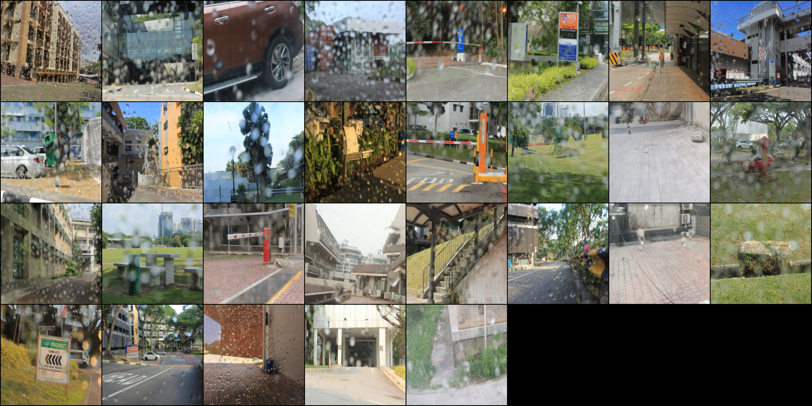
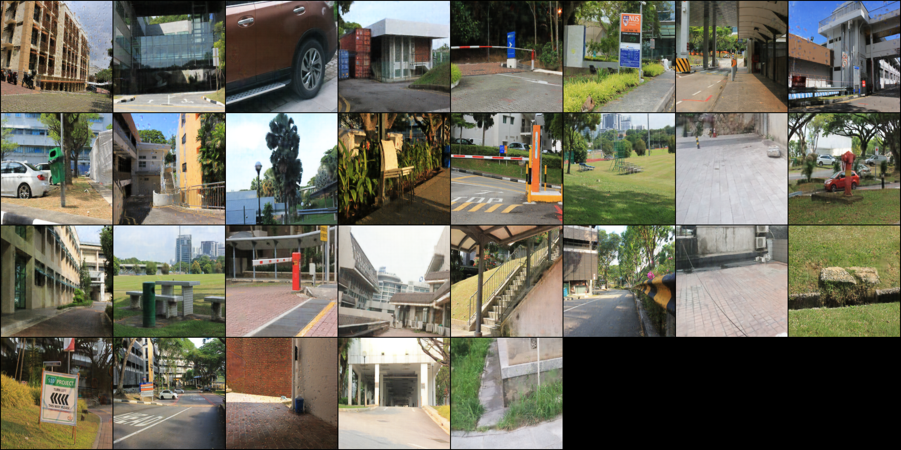

# De-raining with Pix2Pix

## Overview
This project focuses on solving the image de-raining task using the Pix2Pix model, a generative adversarial network (GAN) designed for image-to-image translation. The goal is to remove rain streaks from images while preserving details and overall image quality.

## Model Architecture
The Pix2Pix model consists of a U-Net-based generator and a PatchGAN discriminator. The generator learns to transform rainy images into clean versions, while the discriminator ensures that the generated images appear realistic.

## Results
Below are the qualitative results demonstrating the performance of the model after training for 200 epochs.

### Input Image
The original rainy image:

### Output Image
The de-rained image after 200 epochs of training:

